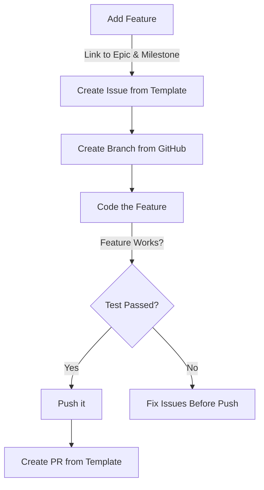

This is the process to follow when adding a feature

```mermaid
graph TD;
    A[Add Feature] -->|Link to Epic & Milestone| B[Create Issue from Template]
    B --> C[Create Branch from GitHub]
    C --> D[Code the Feature]
    D -->|Feature Works?| E{Test Passed?}
    E -->|Yes| F[Push it]
    E -->|No| G[Fix Issues Before Push]
    F --> H[Create PR from Template]
```