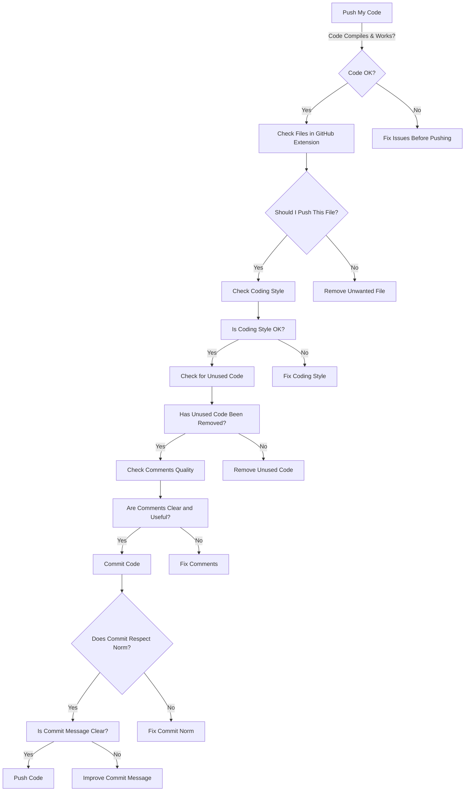

# Process to Push

This is the detail process before pushing your code on any branches.

```mermaid
graph TD;
    A[Push My Code] -->|Code Compiles & Works?| B{Code OK?}
    B -->|Yes| C[Check Files in GitHub Extension]
    B -->|No| D[Fix Issues Before Pushing]
    
    C --> E{Should I Push This File?}
    E -->|Yes| F[Check Coding Style]
    E -->|No| G[Remove Unwanted File]
    
    F --> H[Is Coding Style OK?]
    H -->|Yes| I[Check for Unused Code]
    H -->|No| J[Fix Coding Style]

    I --> K[Has Unused Code Been Removed?]
    K -->|Yes| L[Check Comments Quality]
    K -->|No| M[Remove Unused Code]
    
    L --> N[Are Comments Clear and Useful?]
    N -->|Yes| O[Commit Code]
    N -->|No| P[Fix Comments]

    O --> Q{Does Commit Respect Norm?}
    Q -->|Yes| R[Is Commit Message Clear?]
    Q -->|No| S[Fix Commit Norm]

    R -->|Yes| T[Push Code]
    R -->|No| U[Improve Commit Message]
```